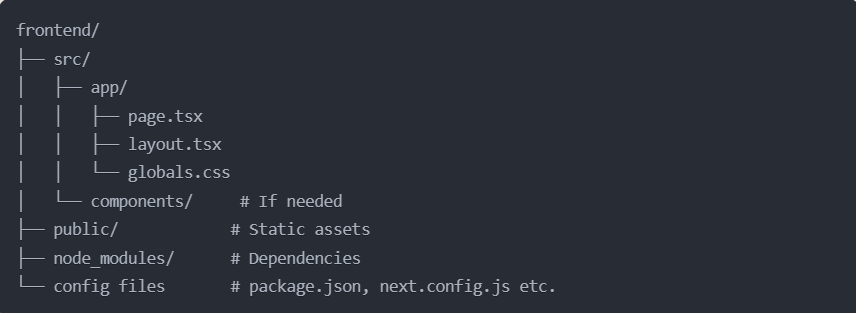
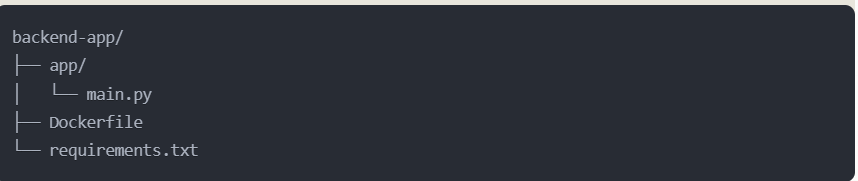

# PDF Chat Assistant

An interactive web application that processes PDFs and enables chat-based interactions with document content using AI.

## 🏗️ Architecture

### Frontend (Next.js)

- TypeScript-based Next.js application
- TailwindCSS for styling
- PDF processing and chat interface
- Real-time communication with backend

### Backend (FastAPI)

- FastAPI for API endpoints
- PDF chunk processing
- OpenAI integration
- Docker containerization

## 🚀 Quick Start

### Backend Setup
```bash
# Start FastAPI server
uvicorn backend.app.main:app --reload
```

# Frontend Setup
```bash
cd frontend
npm install
npm run dev
```
🔑 Key Features

- PDF document processing
- AI-powered chat interactions
- Real-time document analysis
- Cross-origin resource sharing
- Containerized deployment

🌐 Deployment

- Backend: HuggingFace Spaces
- Frontend: Vercel

🛠️ Tech Stack

- Frontend: Next.js, TypeScript, TailwindCSS
- Backend: FastAPI, Python
- AI Integration: OpenAI
- Deployment: HuggingFace Spaces, Vercel

📝 Development Notes

- Implemented secure file handling
- Optimized chunk processing (59 chunks)
- Configured CORS for production domains
